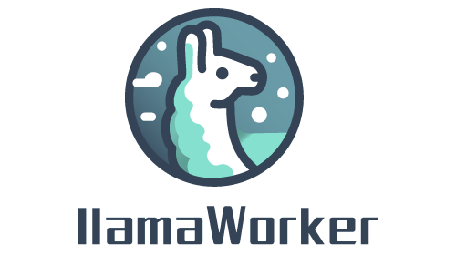
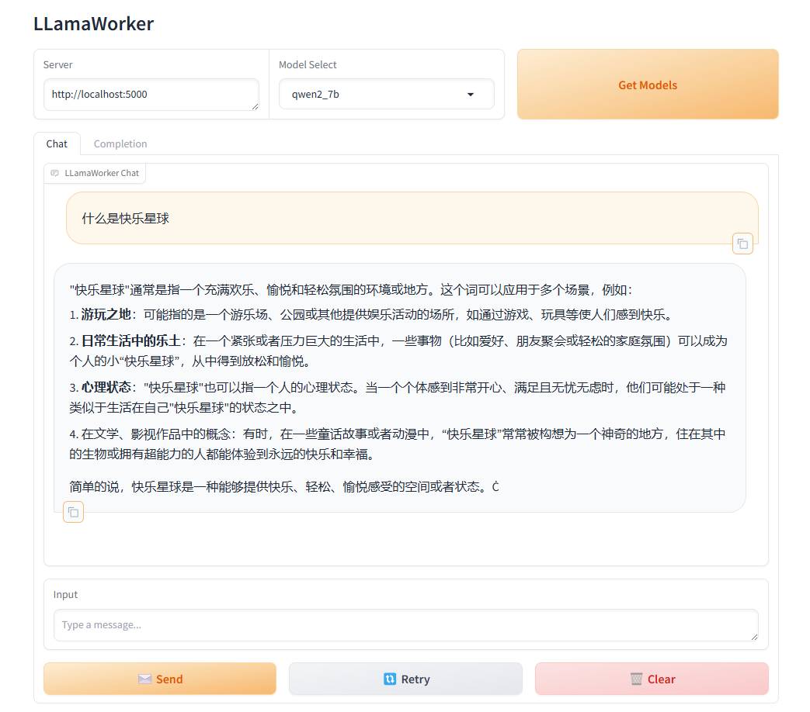

# LLamaWorker

LLamaWorker is a HTTP API server developed based on the [LLamaSharp](https://github.com/SciSharp/LLamaSharp?wt.mc_id=DT-MVP-5005195) project. It provides an OpenAI-compatible API, making it easy for developers to integrate Large Language Models (LLM) into their applications.

English | [中文](README_CN.md) | [日本語](README_JP.md)

## Features

- **OpenAI API Compatible**: Offers an API similar to OpenAI's, facilitating migration and integration.
- **Multi-Model Support**: Supports configuring and switching between different models to meet the needs of various scenarios.
- **Streaming Response**: Supports streaming responses to improve the efficiency of processing large responses.
- **Embedding Support**: Provides text embedding functionality with support for various embedding models.
- **chat templates**: Provides some common chat templates.
- **Auto-Release**: Supports automatic release of loaded models.
- **API Key Authentication**: Supports API Key authentication.
- **Gradio UI Demo**: Provides a UI demo based on Gradio.NET.

## Quick Start

1. Clone the repository locally
   ```bash
   git clone https://github.com/sangyuxiaowu/LLamaWorker.git
   ```
2. Enter the project directory
   ```bash
   cd LLamaWorker
   ```
3. Choose the project file according to your needs. The project provides three versions of the project files:
   - `LLamaWorker.Backend.Cpu`: For CPU environments.
   - `LLamaWorker.Backend.Cuda11`: For GPU environments with CUDA 11.
   - `LLamaWorker.Backend.Cuda12`: For GPU environments with CUDA 12.
   
   Select the project file that suits your environment for the next step.
   
4. Install dependencies
   ```bash
   dotnet restore LLamaWorker.Backend.Cpu\LLamaWorker.Backend.Cpu.csproj
   ```
   If you are using a CUDA version, replace the project file name accordingly.
   
5. Modify the configuration file `appsettings.json`. The default configuration includes some common open-source model configurations, you only need to modify the model file path (`ModelPath`) as needed.
   
6. Start the server
   ```bash
   dotnet run --project LLamaWorker.Backend.Cpu\LLamaWorker.Backend.Cpu.csproj
   ```
   If you are using a CUDA version, replace the project file name accordingly.

## API Reference

LLamaWorker offers the following API endpoints:

- `/v1/chat/completions`: Chat completion requests
- `/v1/completions`: Prompt completion requests
- `/v1/embeddings`: Create embeddings
- `/models/info`: Returns basic information about the model
- `/models/config`: Returns information about configured models
- `/models/{modelId}/switch`: Switch to a specified model

## Gradio UI Demo

This ui is based on [Gradio.NET](https://github.com/feiyun0112/Gradio.Net?wt.mc_id=DT-MVP-5005195).

You can also try the Gradio UI demo by running the following command:

```bash
dotnet restore ChatUI\ChatUI.csproj
dotnet run --project ChatUI\ChatUI.csproj
```

Then open the browser and visit the Gradio UI demo.


