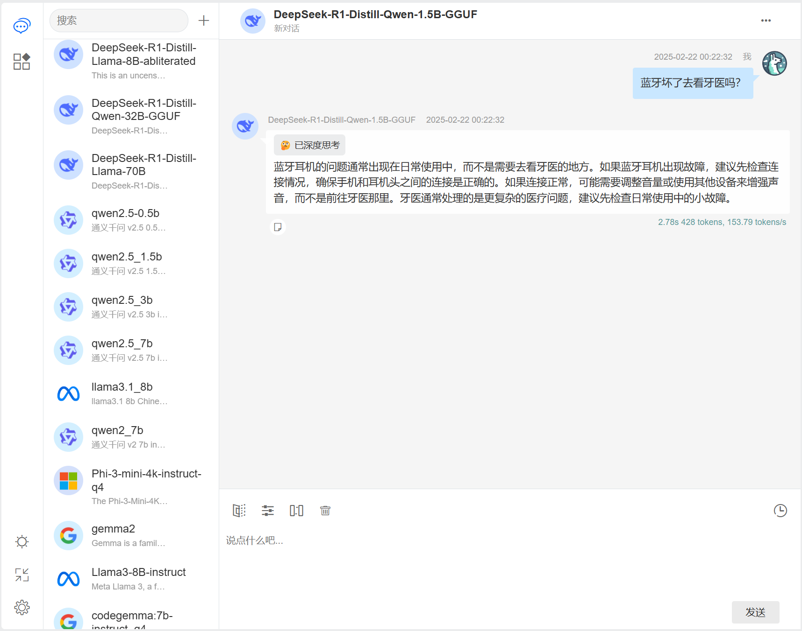

[](https://deepwiki.com/sangyuxiaowu/LLamaWorker)

# LLamaWorker

LLamaWorker is a HTTP API server developed based on the [LLamaSharp](https://github.com/SciSharp/LLamaSharp?wt.mc_id=DT-MVP-5005195) project. It provides an OpenAI-compatible API, making it easy for developers to integrate Large Language Models (LLM) into their applications.

English | [中文](README_CN.md)

## Features

- **OpenAI API Compatible**: Offers an API similar to OpenAI's / Azure OpenAI, making migration and integration easy.
- **Multi-Model Support**: Supports configuring and switching between different models to meet the needs of various scenarios.
- **Streaming Response**: Supports streaming responses to improve the efficiency of processing large responses.
- **Embedding Support**: Provides text embedding functionality with support for various embedding models, including Base64 return support.
- **chat templates**: Provides some common chat templates.
- **Auto-Release**: Supports automatic release of loaded models.
- **Function Call**: Supports function calls.
- **Deep Thinking Switch**: Provides API parameters for flexible switching of deep thinking modes.
- **API Key Authentication**: Supports API Key authentication.
- **Test UI**: Provides a friendly development test UI.
- **Gradio UI Demo**: Provides a UI demo based on Gradio.NET.

## Test UI

When the server starts, it checks for the existence of the `wwwroot` directory. If it exists, it enables static file services.

A `wwwroot.zip` file is provided in the [Releases](../../releases), you can unzip it to the project directory, and then run the project to access the test UI.



This interface provides model switching, chat completion, prompt completion, chat history management, token generation rate display, and other functions. You can test the model effect through this interface.

## Use Vulkan Compiled Version

A Vulkan backend compiled version is provided in the release, you can download the corresponding compiled version from [Releases](../../releases):

- `LLamaWorker-Vulkan-win-x64.zip`
- `LLamaWorker-Vulkan-linux-x64.zip`

After downloading and unzipping, modify the configuration in the `appsettings.json` file, and you can run the software and start using it.

> For other backends, you can also download the `Vulkan` version, go to [llama.cpp](https://github.com/ggerganov/llama.cpp/releases) to download the corresponding compiled version, and replace the relevant libraries. You can also compile the `llama.cpp` project yourself to get the required libraries.

## Function Call

LLamaWorker supports function calls, and currently provides three templates in the configuration file, and has tested the function call effect of `Phi-3`, `Qwen2` and `Llama3.1`.

Function calls are compatible with OpenAI's API, You can test it with the following JSON request:

`POST /v1/chat/completions`

```json
{
  "model": "default",
  "messages": [
    {
      "role": "user",
      "content": "Where is the temperature high between Beijing and Shanghai?"
    }
  ],
  "tools": [
    {
      "function": {
        "name": "GetWeatherPlugin-GetCurrentTemperature",
        "description": "Get the current temperature of the specified city。",
        "parameters": {
          "type": "object",
          "required": [
            "city"
          ],
          "properties": {
            "city": {
              "type": "string",
              "description": "City Name"
            }
          }
        }
      },
      "type": "function"
    },
    {
      "function": {
        "name": "EmailPlugin-SendEmail",
        "description": "Send an email to the recipient.",
        "parameters": {
          "type": "object",
          "required": [
            "recipientEmails",
            "subject",
            "body"
          ],
          "properties": {
            "recipientEmails": {
              "type": "string",
              "description": "A recipient email list separated by semicolons"
            },
            "subject": {
              "type": "string"
            },
            "body": {
              "type": "string"
            }
          }
        }
      },
      "type": "function"
    }
  ],
  "tool_choice": "auto"
}
```

## Compile and Run

1. Clone the repository locally
   ```bash
   git clone https://github.com/sangyuxiaowu/LLamaWorker.git
   ```
2. Enter the project directory
   ```bash
   cd LLamaWorker
   ```
3. Choose the project file according to your needs. The project provides three versions of the project files:
   - `LLamaWorker.Backend.Cpu`: For CPU environments.
   - `LLamaWorker.Backend.Cuda12`: For GPU environments with CUDA 12.
   - `LLamaWorker.Backend.Vulkan`: Vulkan. 
   
   Select the project file that suits your environment for the next step.
   
4. Install dependencies
   ```bash
   dotnet restore LLamaWorker.Backend.Cpu\LLamaWorker.Backend.Cpu.csproj
   ```
   If you are using a CUDA version, replace the project file name accordingly.
   
5. Modify the configuration file `appsettings.json`. The default configuration includes some common open-source model configurations, you only need to modify the model file path (`ModelPath`) as needed.
   
6. Start the server
   ```bash
   dotnet run --project LLamaWorker.Backend.Cpu\LLamaWorker.Backend.Cpu.csproj
   ```
   If you are using a CUDA version, replace the project file name accordingly.

## API Reference

LLamaWorker offers the following API endpoints:

- `/v1/chat/completions`: Chat completion requests
- `/v1/completions`: Prompt completion requests
- `/v1/embeddings`: Create embeddings
- `/models/info`: Returns basic information about the model
- `/models/config`: Returns information about configured models
- `/models/{modelId}/switch`: Switch to a specified model

## Deep Thinking Switch

Provides API parameters for flexible switching of deep thinking modes.

Add the `enable_thinking` parameter in the request, which defaults to `true`. For models that support deep thinking, set it to `false` to turn off the deep thinking mode.

```json
{
  "model": "Qwen3-8B",
  "messages": [
    {
      "role": "user",
      "content": "Where is the temperature high between Beijing and Shanghai?"
    }
  ],
  "enable_thinking": false,
}
```

## Gradio UI Demo

This ui is based on [Gradio.NET](https://github.com/feiyun0112/Gradio.Net?wt.mc_id=DT-MVP-5005195).

You can also try the Gradio UI demo by running the following command:

```bash
dotnet restore ChatUI\ChatUI.csproj
dotnet run --project ChatUI\ChatUI.csproj
```

Then open the browser and visit the Gradio UI demo.


